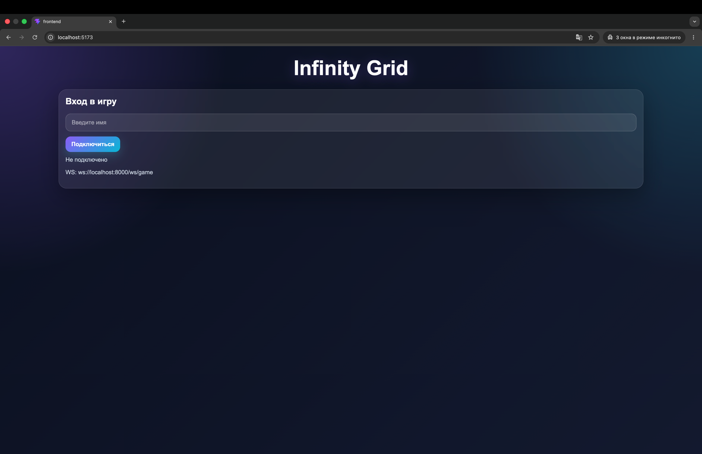
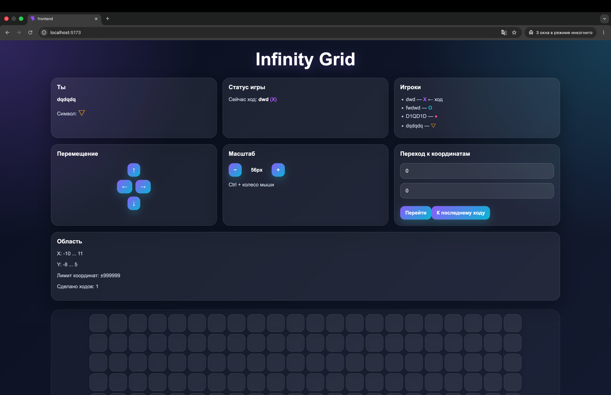
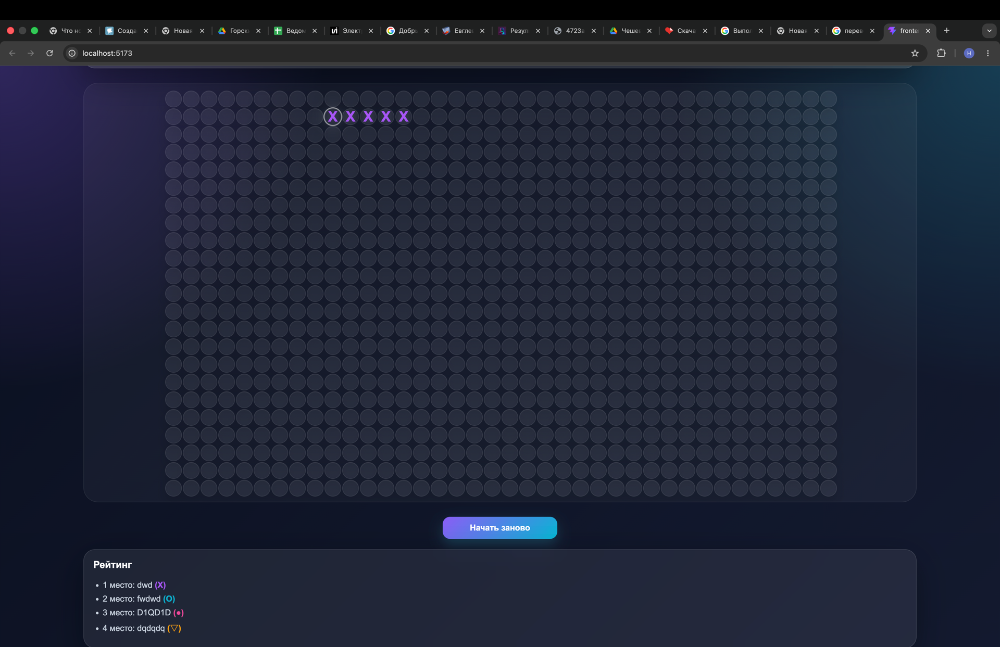
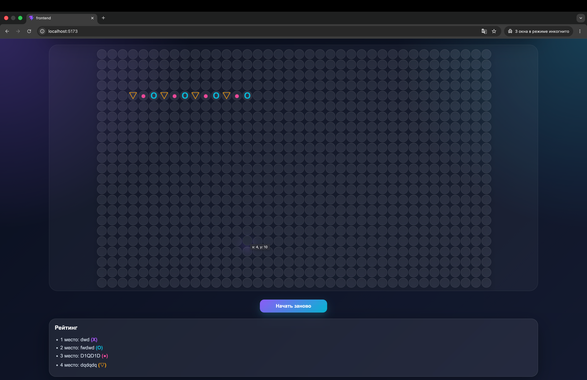

# Infinity Grid

**Infinity Grid** is a multiplayer web game built with **FastAPI + React + WebSocket**.  
It features a large coordinate-based game field, real-time moves, and player connection over a local network.

The game is designed for 4 players. Each player takes turns placing their symbol on the coordinate field. The winner is the first player to place **5 symbols in a row** horizontally, vertically, or diagonally.

---

## Features

- Supports up to **4 players**
- The game starts only after all 4 players are connected
- Real-time move exchange via **WebSocket**
- Large coordinate-based game field
- Coordinate support up to **±99,999,999**
- Win condition based on the **5 in a row** rule
- Colored player symbols
- Current turn display
- Player rating after the game ends
- Game restart option
- Connection from other devices by **IP address in the same Wi-Fi network**
- Game field zooming
- Field navigation
- Jumping to selected coordinates

---

## Project Specification

### Game Rules

- Maximum number of players: **4**
- Minimum number of players required to start: **4**
- Each player receives their own symbol and color
- Players take turns
- One move means placing a symbol in a selected cell
- A symbol cannot be placed in an already occupied cell
- Victory is achieved by placing **5 symbols in a row**
- The following directions are checked:
  - horizontal
  - vertical
  - main diagonal
  - anti-diagonal

### Field Specification

- The game field is coordinate-based
- The field size is visually limited only by the interface
- Supported coordinate range:

```text
X: from -99,999,999 to 99,999,999
Y: from -99,999,999 to 99,999,999
```
---

## Tech Stack

### Backend

* Python
* FastAPI
* Uvicorn
* WebSocket
* Pydantic

### Frontend

* React
* JavaScript
* Vite
* CSS

### Development Tools

* Node.js
* npm
* Python venv
* Git
* VS Code / PyCharm

---
## AI Usage

During development, AI tools were used as an assistant for:

* generating and improving project structure
* writing and refactoring parts of the code
* explaining FastAPI, React and WebSocket logic
* debugging frontend and backend issues
* improving README documentation
* preparing project descriptions and specifications

AI was used only as a development assistant.
The final implementation, testing and integration were reviewed and controlled by the developer.
## Структура проекта

```text
project/
├── backend/
│   ├── main.py
│   ├── game.py
│   ├── requirements.txt
│   └── .venv/
└── frontend/
    ├── src/
    │   ├── App.jsx
    │   ├── main.jsx
    │   └── index.css
    ├── package.json
    └── vite.config.js
```

## Команды запуска

### Backend

```bash
cd backend
python -m venv .venv
source .venv/bin/activate
pip install -r requirements.txt
uvicorn main:app --host 0.0.0.0 --port 8000 --reload
```
### Frontend
```bash
cd frontend
npm install
npm run dev -- --host 0.0.0.0 --port 5173
```

## Screenshots

### Player connection



### Game board



### Winner screen



### losers screen

